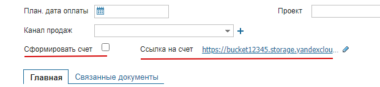

# Формирование документа из счета покупателям сервиса МойСклад
### развернуто в Yandex Cloud Functions. Точка входа через интерфейс Function<T,R>
## producer
    Запускается каждые 2 минуты. 
    Через api пробегает по всем счетам покупателя и при наличии флажка "Сформировать счет" отправляет в яндекс-очередь id этого счета. После чего флажок снимается.
## consumer
    При поступлении в яндекс-очередь сообщений срабатывает триггер, который отправляет в "consumer" json-сообщение.
    Из тела сообщения извлекается Id, по которому через api скачивается шаблон и данные заказа. Далее счет генерируется в формате xls и происходит отцентровка изображений товаров и загрузка в облако.
    Ссылка на файл генерируется и записывается в поле сервиса МойСклад.

Стек:
- Api МойСклад
- Yandex Cloud Functions
- Yandex Message Queue
- Yandex Object Storage